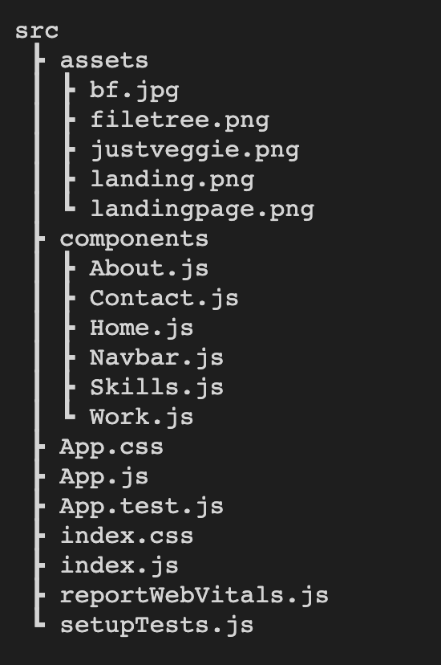
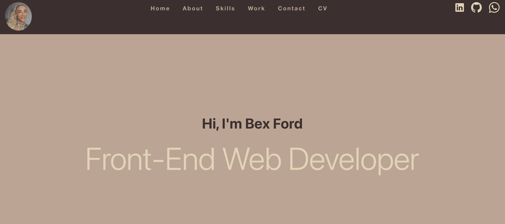

# React Portfolio

This project was bootstrapped with [Create React App](https://github.com/facebook/create-react-app).

## User Story

My task was to create a a React Portfolio to display my work. 

## React Installation 

I installed React using the following command.

```bash
npx create-react-app
```

## File Tree

Components folder has six components as displayed below:



## Final Result 

The final result as displayed below. 



## GitHub 
[GitHub](https://github.com/bex-ford/react-portfolio)

© 2023 Bex Ford
